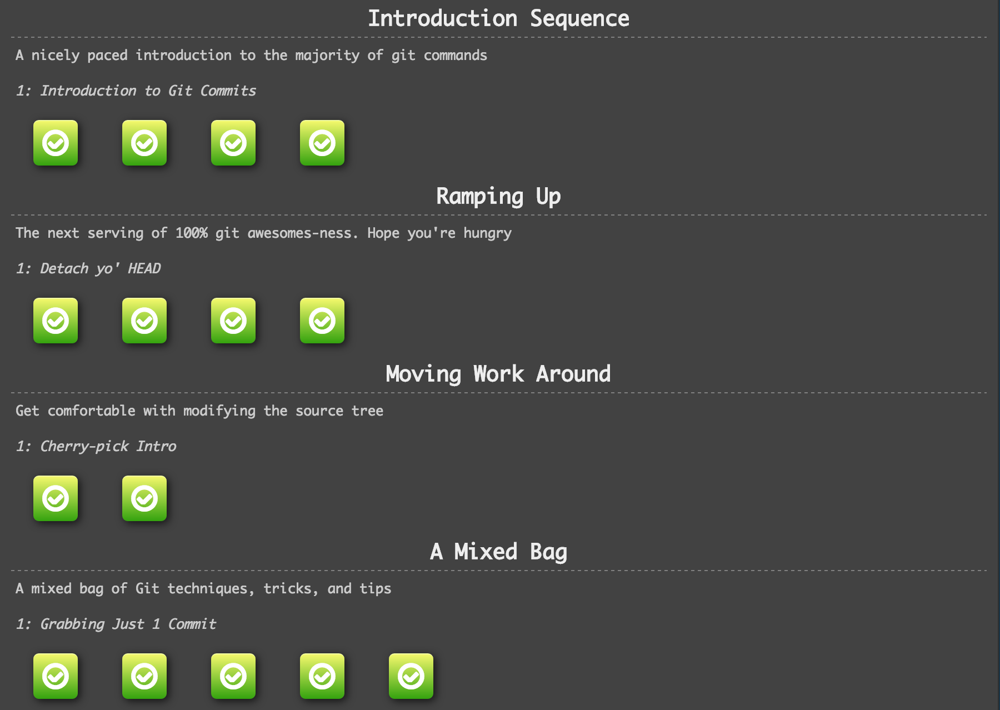
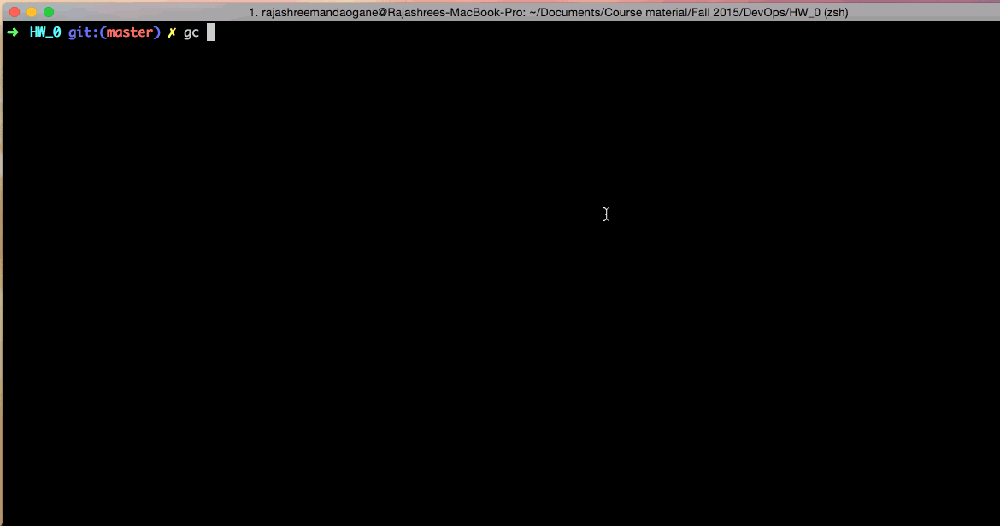

# HW0 solutions, screenshots and gif link

## Git commands

### Level intro1
```
git commit
git commit
```
### Level intro2
```
git branch bugFix
git checkout bugFix
```

### Level intro3
```
git branch bugFix
git checkout bugFix
git commit
git checkout master
git commit
git merge bugFix
```

### Level intro4
```
git branch bugFix
git checkout bugFix
git commit
git checkout master
git commit
git checkout bugFix
git rebase master
```

### Level rampup1
```
git checkout C4
```

### Level rampup2
```
git checkout C4^
```

### Level rampup3
```
git checkout HEAD^
git branch -f master C6
git branch -f bugFix C0
```

### Level rampup4
```
git reset HEAD~1
git checkout pushed
git revert C2
```

### Level move1
```
git cherry-pick C3 C4 C7
```

### Level move2
```
git rebase -i HEAD~4
```

### Level mixed1
```
git rebase -i HEAD~3
git branch -f master C4'
```

### Level mixed2
```
git rebase -i HEAD~2
git rebase -i HEAD~1
git rebase -i HEAD~2
git branch -f master C3''
```

### Level mixed3
```
git checkout master
git cherry-pick C2
git branch -f master C1
git cherry-pick C2' C3
```

### Level mixed4
```
git tag v0 C1
git tag v1 C2
git checkout HEAD^
```

### Level mixed5
```
git commit
```

## Screenshot


## Link to gif


## Contents of post-commit file
```
#!/bin/bash
open https://www.google.com/
```


